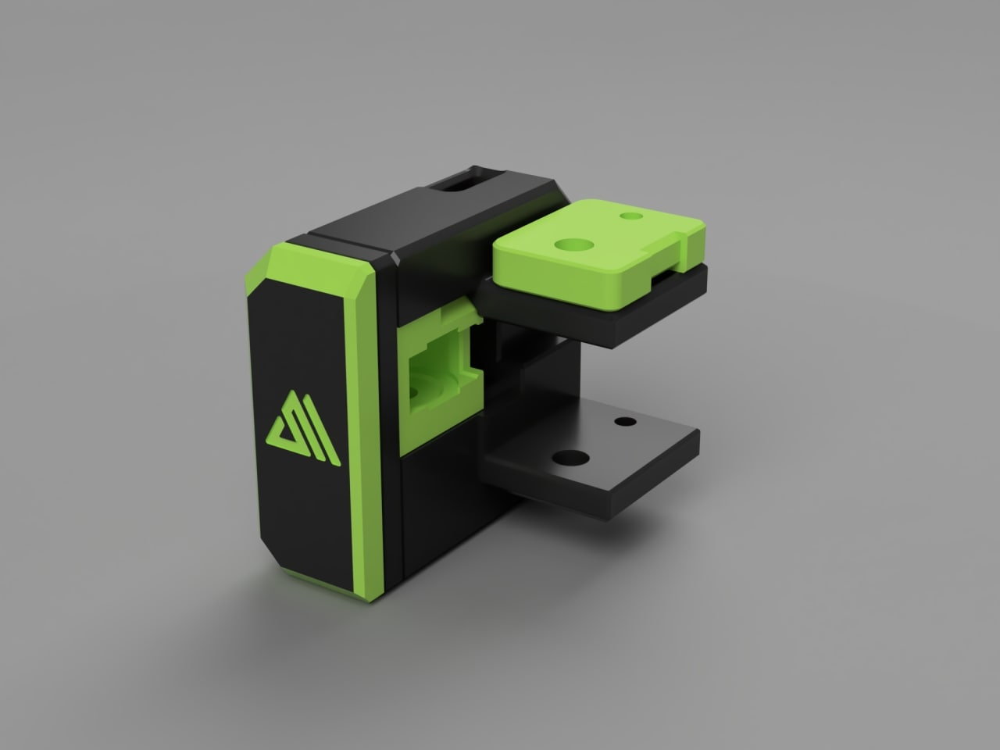

 
# Slim Belt Front Idlers  
Based on <a href="https://github.com/Ramalama2/Voron-2-Mods/tree/main/Front_Idlers">Ramalama mod</a>   
I changed the look to make it more "Voron style"  
Specific parts for Voron 2.4 and Trident  
 

  

    CREDITS: Voron-Team, Ramalama
  

  Thanks guys, you make this possible.

  

    Print Settings:
  

- Default Voron settings, correct orientation, no supports needed! 
- The inlet has 53° overhangs; you want to print the inlet with higher fan speed. (At least 50% in an enclosed printer for ABS!) 
- Try to slide the Inlet in the housing, optimally it should slide fine and have almost no play. In worst case, print the inlet with even more fan and slower! 
- Keep in mind, no play is impossible, but there should be only minimal axial play, only in the front of the inlet. 
- Everything else should be a breeze to print! 
- Seam: You don't want the seam outside, it will look ugly. Rotate the seam to the extrusion mounting side! (Should be "right"), Check the Picture: 

  

  

    BOM: (Multiply by 2 for Left+Right)
  

- 2x M3x30 SHCS (Full threaded) or M3x40 SHCS (Full threaded) 
- 1x M3x8 or M3x10 
- 2x M3 Washer 
- 2x M5 Washer 
- 3x M3-Inserts 
- 2x F695zz or F695-2RS bearing. (You should have this on your actual idler already) 
- 1x 5x18 Pin (g6) 
- 2x 3x6 Magnets 

  

    Tips:
  

Don't even think about buying the 5×18 Pins. 
You will need those pins later everywhere anyway. 
Additionally, most pins that you buy come in H7 and not G6, 
which means they are slightly too thick and you will have to grind them down to fit the bearing. 
Instead, do yourself a favour and <a href="https://a.aliexpress.com/_mLkPTBH">buy this one instead</a>. 
This one comes in G6 (so no grinding down needed for the bearing to fit) and you get them in 500mm super cheap. 
You simply have to cut them to size. 
Buy directly 2 500mm ones, because you will need them for a lot of other mods too! 

  

    Assembly:
  

- Insert the M5 shims and the F695zz bearings one by one and push the pin flush inside. (One by one, because there isn't enough place to put them all together inside) 
- As next step: 
- The M3 inserts, doesn't mean to be inserted hot. Just take the Housing, Housing-Cover, 2x M3 Shims and 2x M3x30 screws, assemble it together and screw the m3 inserts simply inside with the tension of the screws. (They will push fit inside the hole while screwing) 
- The rest is self explanatory. 
- About the covers, I know that the holes there are big, far bigger than needed. But I will release better covers later and maybe different designs. 

  

    Description:
  

- The Problem: - 
1. The default idlers have the issue, at least for me, that the tensioning screw splits the 2 pieces apart. 
 
2. The screw where the bearing sits on, gives the bearing a lot of play. This adds to inconsistencies, not much, but why shouldn't we improve it? Check the video: https://youtu.be/_tG0CdSuppk 
 
- Mod: - 
1. Fixes all issues above. 
2. It's stiffer. 
3. The idlers are 9mm thinner (a solution for Mantis owners). 
4. I can't help myself, but I like the default idlers look. This ones looks in my opinion less vorondesign and more streamlined. I made some covers, but please feel free to open issues or whatever on GitHub with your opinions, how to give them the Voron "touch" or make them more beautiful. 

#

#

#

#

#

#

 